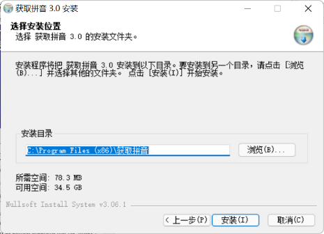
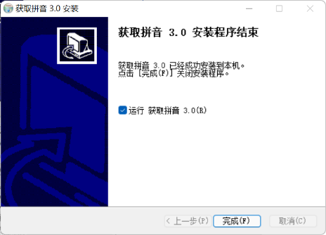
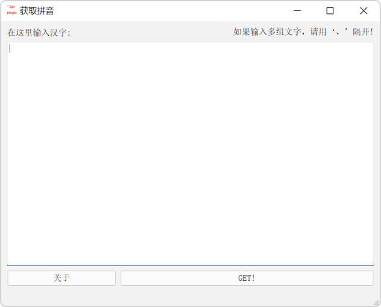
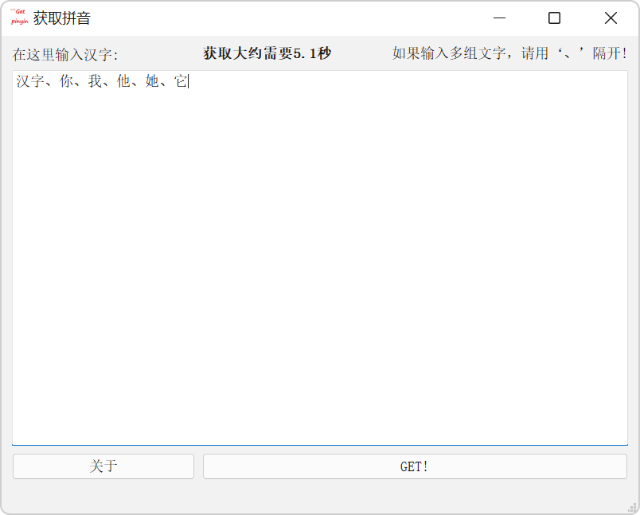
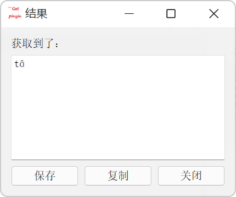
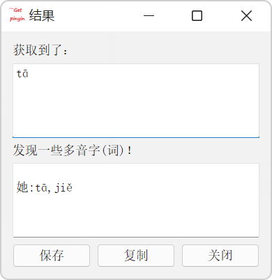

# get-pinyin
 
随手写的一个爬取百度汉语拼音的程序

算上old分支，这已经是3.0版本了
___

### 更新记录

**NEW!**大量更改后的第一个GUI版本--2022.1.28 14:42

___

使用的库：(原生库除外)

pyqt5

requests

lxml

## 使用教程

### Windows

1. 从[Releases](https://github.com/link-fgfgui/get-pinyin/releases)下载安装程序

2. 打开安装程序 

3. 跟随提示，完成安装  

4. 安装程序会自动创建快捷方式 

5. 进入主程序后，即可输入汉字，注意除了分隔用的顿号外，不要输入其他符号 

6. 点击`GET！`按钮，等待片刻，程序将返回拼音 

7. 点保存按钮可以保存拼音到桌面，复制按钮可以复制拼音到剪贴板，按关闭按钮可以进行下一次获取

8. 在主界面点`关于`可以看到程序自述和程序[主页](https://github.com/link-fgfgui/get-pinyin)

9. 在`开始菜单`中可以找到卸载程序，运行即可卸载 Tip: 你也可以打开`控制面板\所有控制面板项\程序和功能`找到`获取拼音 3.0`进行卸载 

[视频教程](https://www.bilibili.com/video/BV1V3411a7dR?zw)

<video width="320" height="240" controls>
    <source src="movie/movie.mp4" type="video/mp4">
</video>

### Mac
自己下python,装好库文件,下源文件运行

### Android,ios

*等我再研究研究*
