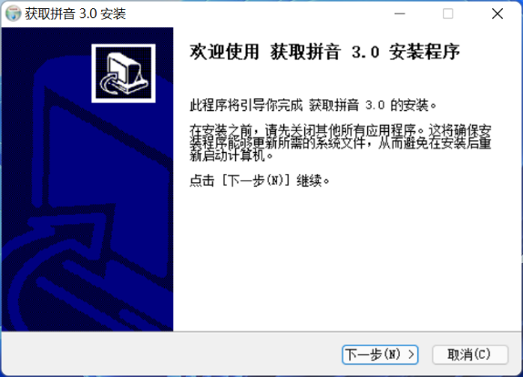

# get-pinyin
 
随手写的一个爬取百度汉语拼音的程序

算上old分支，这已经是3.0版本了
___

### 更新记录

**NEW!**大量更改后的第一个GUI版本--2022.1.28 14:42

___

使用的库：(原生库除外)

pyqt5

requests

lxml

## 使用教程

### Windows

1. 从[Releases](https://github.com/link-fgfgui/get-pinyin/releases)下载安装程序

2. 打开安装程序

### Mac
自己下python,装好库文件,下源文件运行

### Android,ios

*等我再研究研究*
